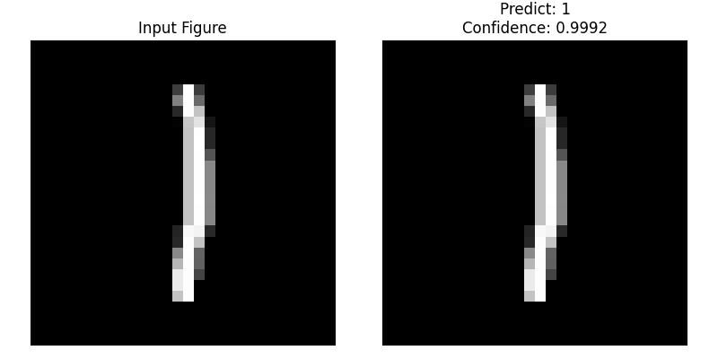

# Spiking Neural Network for MNIST Classification in PyTorch

[](https://opensource.org/licenses/MIT)
[](https://www.python.org/downloads/release/python-380/)

This project provides a clear and well-documented implementation of a Spiking Neural Network (SNN) for classifying MNIST handwritten digits. It is built entirely in PyTorch and serves as an excellent educational resource for understanding how to simulate SNNs, handle their temporal dynamics, and train them using surrogate gradients.



---

## ✨ Features

- **Modular SNN Layers**: The `layer.py` file provides reusable building blocks like `LIFSpike` neurons and time-aware wrappers (`tdLayer`, `SeqToANNContainer`) for standard PyTorch layers.
- **MLP-based SNN Architecture**: A simple yet effective Multi-Layer Perceptron (MLP) structure is used, making the network easy to understand.
- **Surrogate Gradient Training**: Implements a custom `torch.autograd.Function` (`ZIF`) to enable backpropagation through the non-differentiable spiking process.
- **Complete Workflow**: Includes scripts for training (`train.py`) and inference (`test.py`), covering the entire machine learning pipeline.
- **Interactive Inference**: The inference script allows testing on both random MNIST samples and custom user-provided images, with clear visualizations.

---

## 📂 Project Structure

Based on the provided code, the project is organized as follows:

```
.
├── checkpoints/         # Stores trained model weights (e.g., mnist_mlp.pth)
├── data/                # Stores the MNIST dataset (auto-downloaded)
├── layer.py             # Core SNN components: LIF neuron, surrogate gradient, layer wrappers
├── model.py             # Defines the SNN network architecture (MLP)
├── train.py             # Script for model training and evaluation
├── test.py              # Script for inference and visualization
├── requirements.txt     # Python dependencies for the project
└── README.md            # This file
```

---

## 🚀 Getting Started

### 1. Clone the Repository

```bash
git clone https://github.com/[Your-GitHub-Username]/[Your-Repo-Name].git
cd [Your-Repo-Name]
```

### 2. Set Up Environment and Install Dependencies

Using a virtual environment is highly recommended.

```bash
# Create and activate a conda environment
conda create -n snn_mnist python=3.8
conda activate snn_mnist

# Install the required packages from requirements.txt
pip install -r requirements.txt
```

### 3. Train the Model

Run the training script. It will automatically download the MNIST dataset and save the best model weights to the `checkpoints/` directory.

```bash
python train.py
```

### 4. Run Inference

Execute the inference script to see the model in action.

```bash
python test.py
```

The script will prompt you to:
- **Choose 1**: To test with a random image from the MNIST test set.
- **Choose 2**: To provide a path to your own image of a handwritten digit.

---

## 🧠 SNN Principles & Model Architecture

This project simulates an SNN over discrete time steps ($T=6$ by default in `model.py`). Unlike traditional ANNs, SNNs are stateful and process information over time. Here’s how it's implemented in this codebase:

### 1. Input Encoding

A static MNIST image ($28 \times 28$) must be converted into a temporal format. This project uses **direct input encoding**. The flattened image vector is simply copied and presented to the network at each of the $T$ time steps. This is handled by the `add_dimention` function in `layer.py`, which effectively simulates a constant input current over the simulation duration.

### 2. The Leaky Integrate-and-Fire (LIF) Neuron

The core processing unit is the LIF neuron, implemented in the `LIFSpike` class in `layer.py`. It mimics a biological neuron by maintaining a `membrane potential`, which changes over time.

The simulation loop inside `LIFSpike.forward` performs three key steps at each time step $t$:

1.  **Integrate (with Leak)**: The membrane potential `mem` is updated based on the new input from the previous layer and its previous state. The `self.tau` parameter controls the "leak," causing the potential to decay over time if there's no input. The update rule is:
    ```math
    V[t] = V[t-1] \cdot \tau + I[t]
    ```
    Where $V[t]$ is the membrane potential at time $t$, $\tau$ is the decay constant, and $I[t]$ is the input from the connected layer.

2.  **Fire**: If the membrane potential $V[t]$ exceeds a predefined `self.thresh` (threshold), the neuron generates an output spike (a value of 1). Otherwise, the output is 0.
    ```math
    S[t] = \begin{cases} 1, & \text{if } V[t] > V_{th} \\ 0, & \text{otherwise} \end{cases}
    ```

3.  **Reset**: After firing a spike, the neuron's potential needs to be reset. This implementation uses a "soft reset" mechanism: `mem = (1 - spike) * mem`. If a spike occurs (`spike=1`), the potential is reset to 0. If not (`spike=0`), it remains unchanged.

### 3. The Challenge: Training with Backpropagation

The "Fire" step is a step function, which is non-differentiable. Its derivative is zero almost everywhere and infinite at the threshold. This "dead gradient" problem prevents standard backpropagation from working.

### 4. The Solution: Surrogate Gradients

To solve this, we use the **surrogate gradient** method. During the forward pass, we use the actual step function for spiking. However, during the backward pass, we replace its non-existent gradient with a "surrogate"—a well-behaved, continuous function that approximates it.

This is implemented in the `ZIF` class (`torch.autograd.Function`) in `layer.py`:
-   `ZIF.forward`: Implements the standard step function `(input > 0).float()`.
-   `ZIF.backward`: Implements the surrogate gradient. The code uses a triangular-shaped function centered at the threshold:
    ```math
    \frac{\partial S}{\partial V} \approx \max\left(0, \frac{1}{\gamma^2}(\gamma - |V - V_{th}|)\right)
    ```
    Here, `gamma` controls the width of the triangle, defining the region where gradients can flow back through the neuron. This allows the network to learn effectively using standard optimizers like Adam.

### 5. Network Architecture & Output Decoding

The overall architecture, defined in `model.py`, is an MLP with the following structure:

`Input (784) -> Linear(512) -> LIF -> Linear(512) -> LIF -> Linear(10)`

-   **Time-Aware Layers**: Standard `nn.Linear` layers are wrapped in the `tdLayer` class, which uses `SeqToANNContainer` to apply the linear transformation independently at each time step.
-   **Output Decoding**: The final layer is a linear layer that outputs a potential for each of the 10 classes at each time step. To get a final prediction, the model averages these potentials across the time dimension: `x = x.mean(1)`. This is a form of "rate coding," where the class corresponding to the neuron with the highest average potential is chosen as the final prediction. This final tensor is then passed to a standard `CrossEntropyLoss` function for training.

---

## 🤝 Contributing

Pull requests are welcome. For major changes, please open an issue first to discuss what you would like to change.

---

## 📄 License

This project is licensed under the [MIT License](LICENSE).

---

## 🙏 Acknowledgments

- Special thanks to [脉冲神经网络实战课程](https://space.bilibili.com/1765043733).